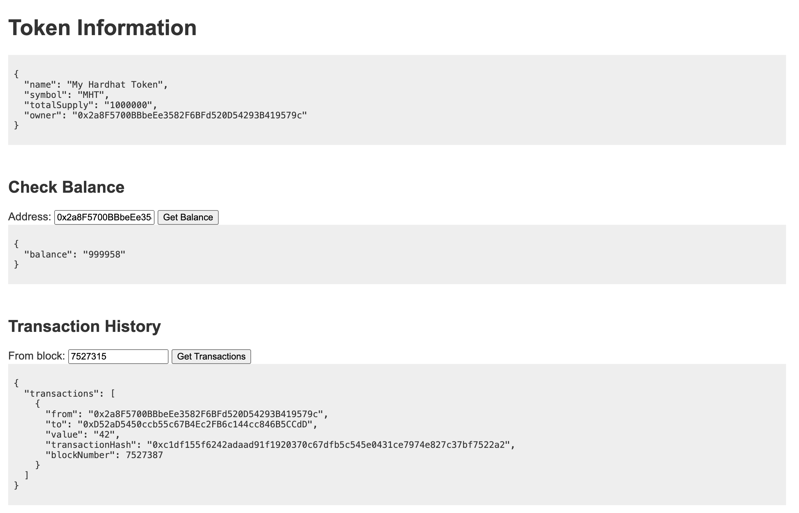

# Ethereum smart contract demo

This is a demo smart contract + an api to view contract info and transactions.

- Contract is deployed to Sepolia (`addr 0xE6cD919827849567c9556320AEd6039413288A0c`)
- Run `cd api && npm run serve` to serve the api and open [http://localhost:3000](http://localhost:3000)
- Run `cd contract && npm run transfer` to perform a transfer of tokens within this contract

This is just a demo, don't expect much of it 😇

— Jędrzej Lewandowski

## Screenshot

